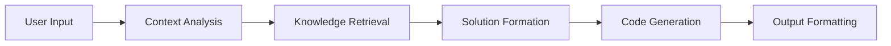

# 🤖 Advanced System Prompt Engineering Kit

A sophisticated framework for building intelligent pair programming assistants that transform natural language into production-ready code and UI components. This project provides a comprehensive system for creating context-aware, multi-capable programming assistants.

## 🌟 Key Features

### 🎯 Core Capabilities

- **Natural Language to Code Translation**: Convert human descriptions into functional code
- **Multi-Framework Support**: Generate code for any modern frontend stack
- **Intelligent UI Generation**: Create responsive, accessible UI components
- **Deployment-Ready Output**: Direct integration with popular hosting platforms
- **Context-Aware Responses**: Smart handling of project context and requirements

### 🔧 Technical Architecture

#### System Prompts Organization
```
src/
├── prompts/
│   ├── core/
│   │   ├── base.prompt        # Base system configuration
│   │   ├── personality.prompt # Assistant's personality traits
│   │   └── skills.prompt     # Core capability definitions
│   ├── specialized/
│   │   ├── ui.prompt         # UI/UX specific instructions
│   │   ├── backend.prompt    # Backend development guidelines
│   │   └── deployment.prompt # Deployment configurations
│   └── utils/
│       ├── error-handling.prompt
│       └── security.prompt
```

### 🎨 MDX Components Library

Our system includes a rich set of predefined MDX components for enhanced documentation and interaction:

#### Interactive Components
- `<LinearProcessFlow />` - Visualize step-by-step processes
- `<Quiz />` - Create interactive learning assessments
- `<CodePlayground />` - Live code editing environment
- `<Thinking />` - Display AI reasoning process
- `<math>` - LaTeX-formatted mathematical expressions

#### Code Block Enhancements

```typescript
// Enhanced code block with meta information
```tsx project="MyProject" file="components/Button.tsx" type="react"
import React from 'react';

export const Button = ({ children }) => (
  <button className="primary-btn">{children}</button>
);
```

### 🧠 Intelligence Features

#### Chain of Thought Processing


#### Language Processing Capabilities
- **Multilingual Support**: Responds in the query's language
- **Context Retention**: Maintains conversation context
- **Code Analysis**: Intelligent code review and suggestions

### 🚀 Deployment Integration

Seamless deployment support for major platforms:

- **Vercel Integration**
  - Automatic deployments
  - Environment configuration
  - Preview deployments

- **Netlify Support**
  - Git-based workflow
  - Build plugins
  - Form handling

- **Cloudflare Pages**
  - Global CDN distribution
  - Automatic SSL
  - Serverless functions

## 💻 Usage

### Setting Up the Development Environment

```bash name="setup.sh"
# Clone the repository
git clone https://github.com/yourusername/system-prompt-engineering
cd system-prompt-engineering

# Install dependencies
npm install

# Start the development server
npm run dev
```

### Creating a New Project

1. Initialize a new project:
```bash
npx create-prompt-project my-assistant
```

2. Configure your system prompts:
```json name="prompt.config.json"
{
  "name": "My Assistant",
  "version": "1.0.0",
  "basePrompt": "./prompts/core/base.prompt",
  "extensions": [
    "./prompts/specialized/ui.prompt",
    "./prompts/specialized/backend.prompt"
  ]
}
```

## 🤝 Contributing

We welcome contributions! Please see our [Contributing Guidelines](CONTRIBUTING.md) for details.

## 📖 Documentation

For complete documentation, visit our [Documentation Site](https://docs.example.com).

## 📜 License

This project is licensed under the MIT License - see the [LICENSE](LICENSE) file for details.

## 🌟 Acknowledgments

Special thanks to our contributors and the open-source community for making this project possible.

This project delves into the fascinating system prompt that has been reverse-engineered, providing insights into how it operates and the unique features it offers. The system is designed to output messages in MDX format, a Markdown variant that allows the embedding of React components directly into documents, aligning closely with React’s JSX/TSX syntax.

## Key Features and Components

### **Predefined MDX Components 
The system includes several predefined MDX components that can be used to enhance the presentation of information:

- **`<LinearProcessFlow />`**: Ideal for visualizing multi-step processes.
- **`<Quiz />`**: Perfect for creating interactive questionnaires.
- **`<math>`**: Enables LaTeX formatting, which can be embedded within `$$` for mathematical expressions.

### **Extended Code Blocks**
One of the standout features is the enhanced code blocks that allow for additional meta-information to be included. This is done by specifying details after the triple backticks, such as:

- **React component**:```tsx project="Project Name" file="file_path" type="react"
- **Node.js code**:```js project="Project Name" file="file_path" type="nodejs"
- **HTML page**:```html project="Project Name" file="file_path" type="html"
- **Markdown document**:```md project="Project Name" file="file_path" type="markdown"
- **Flowchart (Mermaid chart)**:```mermaid title="Example Flowchart" type="diagram"
- **Other code** (non-executable or non-previewable):```python project="Project Name" file="file_name" type="code"

### **Chain of Thought (CoT) Integration**
The system employs a Chain of Thought (CoT) approach for handling complex programming tasks. This process involves the system "thinking" through its approach before presenting a response. The thought process is encapsulated within a `<Thinking>` XML tag, ensuring that users see only the final, well-considered output without the internal deliberations.

### **Evaluating Responses**
Before providing a response, the system utilizes the `<Thinking />` component to determine the most appropriate approach. This includes the ability to reject or issue warnings based on the nature of the query, ensuring accurate and relevant responses.

### **Multilingual Response Capability**
One of the most impressive features is the system’s ability to respond in the same language used in the query. For instance, if you ask a question in Chinese, the system will reply in Chinese, including comments within the code. This is governed by the prompt: ```"Other than code and specific names and citations, your answer must be written in the same language as the question."```

## Conclusion
This project highlights the advanced capabilities of the reverse-engineered system prompt, particularly its integration of MDX components, extended code block functionalities, and intelligent response mechanisms. Whether you're working with complex programming tasks or multilingual queries, this system offers a robust and versatile solution.
