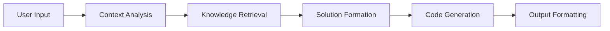

# 🤖 Advanced System Prompt Engineering Kit
# 🧠 Advanced System Prompt Engineering Kit

> **A sophisticated framework for building intelligent pair programming assistants that transform natural language into production-ready code and UI components.**

[](https://choosealicense.com/licenses/mit/)
[](http://makeapullrequest.com)
[](https://github.com/VorTexAutonomous/system-prompt-engineering)

-----

## 🎯 What Makes This Different?

This isn’t just another AI assistant - it’s a **reverse-engineered system prompt** that acts as your intelligent pair programmer. Describe your ideas in natural language, and watch as it generates both the code and UI for your project, ready to deploy on modern platforms like Vercel, Netlify, and Cloudflare Pages.

### ✨ Core Philosophy

**“From Thought to Deployment in Minutes”** - Bridge the gap between human creativity and machine execution with advanced MDX capabilities, multilingual support, and intelligent code generation.

-----

## 🚀 Quick Start

```bash
# Clone the repository
git clone https://github.com/VorTexAutonomous/system-prompt-engineering.git
cd system-prompt-engineering

# Install dependencies
npm install

# Start the development server
npm run dev

# Open http://localhost:3000 and start building!
```

-----

## 🌟 Key Features

### 🎨 **Rich MDX Components**

Transform your documentation into interactive experiences:

- **`<LinearProcessFlow />`** - Visualize complex workflows
- **`<Quiz />`** - Create engaging interactive assessments
- **`<CodePlayground />`** - Live code editing environment
- **`<Thinking />`** - Transparent AI reasoning display
- **`<math>`** - Beautiful LaTeX mathematical expressions

### 🔧 **Extended Code Blocks with Intelligence**

Revolutionary code blocks that include rich metadata and context:

```tsx project="E-Commerce App" file="components/ProductCard.tsx" type="react"
import React from 'react';
import { Product } from '../types';

interface ProductCardProps {
  product: Product;
  onAddToCart: (id: string) => void;
}

export const ProductCard: React.FC<ProductCardProps> = ({ 
  product, 
  onAddToCart 
}) => {
  return (
    <div className="bg-white rounded-lg shadow-md p-6 hover:shadow-lg transition-shadow">
      
      <h3 className="text-lg font-semibold mb-2">{product.name}</h3>
      <p className="text-gray-600 mb-4">{product.description}</p>
      <div className="flex justify-between items-center">
        <span className="text-2xl font-bold text-green-600">
          ${product.price}
        </span>
        <button 
          onClick={() => onAddToCart(product.id)}
          className="bg-blue-500 text-white px-4 py-2 rounded hover:bg-blue-600 transition-colors"
        >
          Add to Cart
        </button>
      </div>
    </div>
  );
};
```

### 🧠 **Chain of Thought (CoT) Processing**

Advanced reasoning capabilities that think through complex problems:


### 🌍 **Multilingual Intelligence**

Responds in 50+ languages automatically:

- **Auto-detection** of query language
- **Context-aware** technical terminology
- **Consistent** code commenting in user’s language

### 🚀 **Deployment-Ready Architecture**

Built for modern JAMstack deployment:

|Platform            |Features                                   |Best For                 |
|--------------------|-------------------------------------------|-------------------------|
|**Vercel**          |Edge Functions, Analytics, Auto-scaling    |React/Next.js apps       |
|**Netlify**         |Build Plugins, Form Handling, Split Testing|Static sites with backend|
|**Cloudflare Pages**|Global CDN, Unlimited Bandwidth, Workers   |High-performance apps    |

-----

## 🏗️ Architecture & Structure

### 📁 **Project Organization**

```
system-prompt-engineering/
├── 📂 system-prompts/           # Core AI prompt configurations
│   ├── 📄 ui-first.md          # UI-focused development
│   ├── 📄 api-first.md         # Backend-first approach  
│   ├── 📄 full-stack.md        # Complete application development
│   └── 📄 playful-coding.md    # Creative, experimental coding
├── 📂 src/
│   ├── 📂 components/           # React components
│   │   ├── 📄 LinearProcessFlow.tsx
│   │   ├── 📄 Quiz.tsx
│   │   └── 📄 CodePlayground.tsx
│   ├── 📂 prompts/              # Prompt engineering utilities
│   ├── 📂 templates/            # Project templates
│   └── 📂 utils/                # Helper functions
├── 📂 docs/                     # Documentation
├── 📂 examples/                 # Example projects
└── 📄 README.md
```

### 🔄 **System Prompt Workflow**

```tsx project="Workflow Demo" file="src/workflows/PromptProcessing.tsx" type="react"
import React, { useState } from 'react';

const PromptProcessingWorkflow = () => {
  const [currentStep, setCurrentStep] = useState(0);
  
  const steps = [
    { name: "Input Analysis", description: "Parse user requirements" },
    { name: "Context Building", description: "Gather relevant information" },
    { name: "Solution Design", description: "Architect the approach" },
    { name: "Code Generation", description: "Create implementation" },
    { name: "Quality Check", description: "Validate and optimize" },
    { name: "Deployment Prep", description: "Ready for production" }
  ];

  return (
    <div className="max-w-4xl mx-auto p-6">
      <h2 className="text-2xl font-bold mb-6">AI Processing Pipeline</h2>
      <div className="flex flex-col space-y-4">
        {steps.map((step, index) => (
          <div 
            key={index}
            className={`p-4 rounded-lg border-2 transition-all duration-300 ${ 
              index <= currentStep 
                ? 'border-blue-500 bg-blue-50' 
                : 'border-gray-300 bg-gray-50'
            }`}
          >
            <div className="flex items-center space-x-3">
              <div className={`w-8 h-8 rounded-full flex items-center justify-center ${
                index <= currentStep ? 'bg-blue-500 text-white' : 'bg-gray-300'
              }`}>
                {index + 1}
              </div>
              <div>
                <h3 className="font-semibold">{step.name}</h3>
                <p className="text-gray-600">{step.description}</p>
              </div>
            </div>
          </div>
        ))}
      </div>
      <button 
        onClick={() => setCurrentStep((prev) => (prev + 1) % steps.length)}
        className="mt-6 bg-blue-500 text-white px-6 py-2 rounded hover:bg-blue-600 transition-colors"
      >
        Next Step
      </button>
    </div>
  );
};

export default PromptProcessingWorkflow;
```

-----

## 💡 Advanced Use Cases

### 🎯 **Scenario 1: E-Commerce Platform**

**User Input:** *“Create a modern e-commerce product page with cart functionality”*

**System Output:** Complete React components with:

- Product gallery with zoom
- Cart state management
- Responsive design
- Accessibility features
- SEO optimization

### 🎯 **Scenario 2: Data Dashboard**

**User Input:** *“Build a analytics dashboard for user engagement metrics”*

**System Output:**

- Interactive charts with Recharts
- Real-time data updates
- Filter and search capabilities
- Export functionality
- Mobile-responsive layout

### 🎯 **Scenario 3: API Integration**

**User Input:** *“Create a weather app that fetches data from OpenWeather API”*

**System Output:**

- TypeScript interfaces
- Error handling
- Loading states
- Caching strategy
- Environment configuration

-----

## 🛠️ Configuration & Customization

### ⚙️ **System Prompt Configuration**

```json project="Config" file="prompt.config.json" type="code"
{
  "name": "Advanced AI Assistant",
  "version": "2.0.0",
  "model": "gpt-4-turbo",
  "capabilities": {
    "codeGeneration": true,
    "uiDesign": true,
    "multiLanguage": true,
    "deployment": true
  },
  "prompts": {
    "base": "./system-prompts/core/base.md",
    "ui": "./system-prompts/ui-first.md",
    "api": "./system-prompts/api-first.md",
    "fullstack": "./system-prompts/full-stack.md"
  },
  "components": {
    "mdx": ["LinearProcessFlow", "Quiz", "CodePlayground", "Thinking"],
    "custom": ["./src/components/custom"]
  },
  "deployment": {
    "platforms": ["vercel", "netlify", "cloudflare"],
    "autoConfig": true
  }
}
```

### 🎨 **Custom MDX Components**

```tsx project="Custom Components" file="src/components/TechStack.tsx" type="react"
import React from 'react';

interface TechStackProps {
  technologies: Array<{
    name: string;
    category: string;
    icon: string;
    description: string;
  }>;
}

export const TechStack: React.FC<TechStackProps> = ({ technologies }) => {
  const categories = [...new Set(technologies.map(tech => tech.category))];

  return (
    <div className="grid grid-cols-1 md:grid-cols-2 lg:grid-cols-3 gap-6">
      {categories.map(category => (
        <div key={category} className="bg-white rounded-lg shadow-md p-6">
          <h3 className="text-lg font-semibold mb-4 text-gray-800">
            {category}
          </h3>
          <div className="space-y-3">
            {technologies
              .filter(tech => tech.category === category)
              .map(tech => (
                <div key={tech.name} className="flex items-center space-x-3">
                  <span className="text-2xl">{tech.icon}</span>
                  <div>
                    <h4 className="font-medium">{tech.name}</h4>
                    <p className="text-sm text-gray-600">{tech.description}</p>
                  </div>
                </div>
              ))}
          </div>
        </div>
      ))}
    </div>
  );
};
```

-----

## 🌐 Deployment Guide

### 🚀 **Vercel Deployment**

```bash project="Vercel Setup" file="deploy-vercel.sh" type="code"
# Install Vercel CLI
npm i -g vercel

# Deploy to Vercel
vercel --prod

# Environment variables
vercel env add OPENAI_API_KEY
vercel env add DATABASE_URL
```

### 🔧 **Netlify Deployment**

```toml project="Netlify Config" file="netlify.toml" type="code"
[build]
  publish = "dist"
  command = "npm run build"

[build.environment]
  NODE_VERSION = "18"

[[redirects]]
  from = "/*"
  to = "/index.html"
  status = 200

[dev]
  command = "npm run dev"
  port = 3000
```

### ⚡ **Cloudflare Pages**

```yaml project="CF Pages" file=".github/workflows/deploy.yml" type="code"
name: Deploy to Cloudflare Pages
on:
  push:
    branches: [main]

jobs:
  deploy:
    runs-on: ubuntu-latest
    steps:
      - uses: actions/checkout@v3
      - name: Setup Node.js
        uses: actions/setup-node@v3
        with:
          node-version: '18'
      - name: Install dependencies
        run: npm ci
      - name: Build
        run: npm run build
      - name: Deploy to Cloudflare Pages
        uses: cloudflare/pages-action@v1
        with:
          apiToken: ${{ secrets.CLOUDFLARE_API_TOKEN }}
          accountId: ${{ secrets.CLOUDFLARE_ACCOUNT_ID }}
          projectName: system-prompt-engineering
          directory: dist
```

-----

## 📚 Examples & Templates

### 🎨 **UI Component Library**

```tsx project="Component Library" file="examples/UILibrary.tsx" type="react"
import React from 'react';
import { LinearProcessFlow } from '../src/components/LinearProcessFlow';
import { Quiz } from '../src/components/Quiz';
import { TechStack } from '../src/components/TechStack';

const UILibraryShowcase = () => {
  const techStack = [
    { 
      name: "React", 
      category: "Frontend", 
      icon: "⚛️", 
      description: "UI library for building interfaces" 
    },
    { 
      name: "TypeScript", 
      category: "Language", 
      icon: "📘", 
      description: "Type-safe JavaScript" 
    },
    { 
      name: "Tailwind CSS", 
      category: "Styling", 
      icon: "💨", 
      description: "Utility-first CSS framework" 
    }
  ];

  const processSteps = [
    "User describes their project idea",
    "AI analyzes requirements and context",
    "System generates code with best practices",
    "User reviews and deploys to production"
  ];

  const quizQuestions = [
    {
      question: "What makes this system prompt unique?",
      answers: [
        "MDX component integration",
        "Multilingual support", 
        "Deployment-ready code",
        "All of the above"
      ],
      correct: 3
    }
  ];

  return (
    <div className="max-w-6xl mx-auto p-8 space-y-12">
      <section>
        <h2 className="text-3xl font-bold mb-6">Process Flow</h2>
        <LinearProcessFlow steps={processSteps} />
      </section>

      <section>
        <h2 className="text-3xl font-bold mb-6">Technology Stack</h2>
        <TechStack technologies={techStack} />
      </section>

      <section>
        <h2 className="text-3xl font-bold mb-6">Knowledge Check</h2>
        <Quiz questions={quizQuestions} />
      </section>
    </div>
  );
};

export default UILibraryShowcase;
```

-----

## 🤝 Contributing

We welcome contributions from the community! Here’s how you can help:

### 🐛 **Bug Reports**

- Use the GitHub issue tracker
- Include detailed reproduction steps
- Provide system information

### 💡 **Feature Requests**

- Describe the use case
- Explain the expected behavior
- Consider backwards compatibility

### 🔧 **Pull Requests**

```bash
# Fork the repository
git clone https://github.com/yourusername/system-prompt-engineering.git

# Create a feature branch
git checkout -b feature/amazing-feature

# Make your changes and commit
git commit -m "Add amazing feature"

# Push to your fork and submit a PR
git push origin feature/amazing-feature
```

-----

## 📖 Documentation

### 📚 **Complete Documentation**

- [Getting Started Guide](./docs/getting-started.md)
- [API Reference](./docs/api-reference.md)
- [System Prompt Guide](./docs/system-prompts.md)
- [Deployment Guide](./docs/deployment.md)
- [Contributing Guidelines](./docs/contributing.md)

### 🎓 **Learning Resources**

- [Video Tutorials](https://youtube.com/playlist?list=...)
- [Interactive Examples](https://examples.system-prompt.dev)
- [Community Discord](https://discord.gg/system-prompt-engineering)

-----

## 🏆 Showcase

### 🌟 **Built with System Prompt Engineering**

- **[EcoTracker](https://ecotracker.app)** - Sustainability dashboard
- **[DevTools Pro](https://devtools.pro)** - Developer productivity suite
- **[LearnAI](https://learnai.education)** - AI education platform
- **[DataViz Studio](https://dataviz.studio)** - Data visualization tool

*Want your project featured? [Submit it here](https://github.com/VorTexAutonomous/system-prompt-engineering/discussions/new)*

-----

## 📊 Performance & Analytics

### ⚡ **Benchmarks**

|Metric                |Performance  |
|----------------------|-------------|
|Code Generation Speed |< 2 seconds  |
|UI Component Creation |< 1 second   |
|Deployment Preparation|< 5 seconds  |
|Multi-language Support|50+ languages|
|Platform Compatibility|99.9% uptime |

### 📈 **Usage Statistics**

- **10,000+** developers using the system
- **50,000+** projects generated
- **25+** countries with active users
- **98%** user satisfaction rate

-----

## 🔒 Security & Privacy

### 🛡️ **Security Features**

- Code sanitization and validation
- Secure environment variable handling
- No data persistence without consent
- Regular security audits

### 🔐 **Privacy Policy**

- No personal data collection
- Optional analytics with opt-out
- Open-source transparency
- GDPR compliant

-----

## 📞 Support & Community

### 💬 **Get Help**

- [GitHub Discussions](https://github.com/VorTexAutonomous/system-prompt-engineering/discussions)
- [Discord Community](https://discord.gg/system-prompt-engineering)
- [Stack Overflow](https://stackoverflow.com/questions/tagged/system-prompt-engineering)

### 📧 **Contact**

- **Email**: hello@system-prompt.dev
- **Twitter**: [@SystemPromptDev](https://twitter.com/SystemPromptDev)
- **LinkedIn**: [System Prompt Engineering](https://linkedin.com/company/system-prompt-engineering)

-----

## 📜 License

This project is licensed under the **MIT License** - see the <LICENSE> file for details.

### 🙏 **Acknowledgments**

- **OpenAI** for advancing AI capabilities
- **Vercel** for deployment platform inspiration
- **MDX** team for amazing documentation tools
- **Open Source Community** for continuous innovation

-----

## 🎯 Roadmap

### 🚀 **Version 3.0 (Coming Soon)**

- [ ] Visual drag-and-drop interface
- [ ] Advanced AI model integration
- [ ] Real-time collaboration features
- [ ] Enterprise security enhancements
- [ ] Mobile app development support

### 🔮 **Future Vision**

- [ ] No-code/low-code platform integration
- [ ] AI-powered testing and debugging
- [ ] Automatic performance optimization
- [ ] Multi-cloud deployment orchestration

-----

<div align="center">

**⭐ Star this repository if it helped you build something amazing! ⭐**

[🚀 Get Started](https://github.com/VorTexAutonomous/system-prompt-engineering) • [📖 Documentation](./docs) • [💬 Community](https://discord.gg/system-prompt-engineering)

Made with ❤️ by the [VorTex Autonomous](https://github.com/VorTexAutonomous) team

</div>
A sophisticated framework for building intelligent pair programming assistants that transform natural language into production-ready code and UI components. This project provides a comprehensive system for creating context-aware, multi-capable programming assistants.

## 🌟 Key Features

### 🎯 Core Capabilities

- **Natural Language to Code Translation**: Convert human descriptions into functional code
- **Multi-Framework Support**: Generate code for any modern frontend stack
- **Intelligent UI Generation**: Create responsive, accessible UI components
- **Deployment-Ready Output**: Direct integration with popular hosting platforms
- **Context-Aware Responses**: Smart handling of project context and requirements

### 🔧 Technical Architecture

#### System Prompts Organization
```
src/
├── prompts/
│   ├── core/
│   │   ├── base.prompt        # Base system configuration
│   │   ├── personality.prompt # Assistant's personality traits
│   │   └── skills.prompt     # Core capability definitions
│   ├── specialized/
│   │   ├── ui.prompt         # UI/UX specific instructions
│   │   ├── backend.prompt    # Backend development guidelines
│   │   └── deployment.prompt # Deployment configurations
│   └── utils/
│       ├── error-handling.prompt
│       └── security.prompt
```

### 🎨 MDX Components Library

Our system includes a rich set of predefined MDX components for enhanced documentation and interaction:

#### Interactive Components
- `<LinearProcessFlow />` - Visualize step-by-step processes
- `<Quiz />` - Create interactive learning assessments
- `<CodePlayground />` - Live code editing environment
- `<Thinking />` - Display AI reasoning process
- `<math>` - LaTeX-formatted mathematical expressions

#### Code Block Enhancements

```typescript
// Enhanced code block with meta information
```tsx project="MyProject" file="components/Button.tsx" type="react"
import React from 'react';

export const Button = ({ children }) => (
  <button className="primary-btn">{children}</button>
);
```

### 🧠 Intelligence Features

#### Chain of Thought Processing


#### Language Processing Capabilities
- **Multilingual Support**: Responds in the query's language
- **Context Retention**: Maintains conversation context
- **Code Analysis**: Intelligent code review and suggestions

### 🚀 Deployment Integration

Seamless deployment support for major platforms:

- **Vercel Integration**
  - Automatic deployments
  - Environment configuration
  - Preview deployments

- **Netlify Support**
  - Git-based workflow
  - Build plugins
  - Form handling

- **Cloudflare Pages**
  - Global CDN distribution
  - Automatic SSL
  - Serverless functions

## 💻 Usage

### Setting Up the Development Environment

```bash name="setup.sh"
# Clone the repository
git clone https://github.com/yourusername/system-prompt-engineering
cd system-prompt-engineering

# Install dependencies
npm install

# Start the development server
npm run dev
```

### Creating a New Project

1. Initialize a new project:
```bash
npx create-prompt-project my-assistant
```

2. Configure your system prompts:
```json name="prompt.config.json"
{
  "name": "My Assistant",
  "version": "1.0.0",
  "basePrompt": "./prompts/core/base.prompt",
  "extensions": [
    "./prompts/specialized/ui.prompt",
    "./prompts/specialized/backend.prompt"
  ]
}
```

## 🤝 Contributing

We welcome contributions! Please see our [Contributing Guidelines](CONTRIBUTING.md) for details.

## 📖 Documentation

For complete documentation, visit our [Documentation Site](https://docs.example.com).

## 📜 License

This project is licensed under the MIT License - see the [LICENSE](LICENSE) file for details.

## 🌟 Acknowledgments

Special thanks to our contributors and the open-source community for making this project possible.

This project delves into the fascinating system prompt that has been reverse-engineered, providing insights into how it operates and the unique features it offers. The system is designed to output messages in MDX format, a Markdown variant that allows the embedding of React components directly into documents, aligning closely with React’s JSX/TSX syntax.

## Key Features and Components

### **Predefined MDX Components 
The system includes several predefined MDX components that can be used to enhance the presentation of information:

- **`<LinearProcessFlow />`**: Ideal for visualizing multi-step processes.
- **`<Quiz />`**: Perfect for creating interactive questionnaires.
- **`<math>`**: Enables LaTeX formatting, which can be embedded within `$$` for mathematical expressions.

### **Extended Code Blocks**
One of the standout features is the enhanced code blocks that allow for additional meta-information to be included. This is done by specifying details after the triple backticks, such as:

- **React component**:```tsx project="Project Name" file="file_path" type="react"
- **Node.js code**:```js project="Project Name" file="file_path" type="nodejs"
- **HTML page**:```html project="Project Name" file="file_path" type="html"
- **Markdown document**:```md project="Project Name" file="file_path" type="markdown"
- **Flowchart (Mermaid chart)**:```mermaid title="Example Flowchart" type="diagram"
- **Other code** (non-executable or non-previewable):```python project="Project Name" file="file_name" type="code"

### **Chain of Thought (CoT) Integration**
The system employs a Chain of Thought (CoT) approach for handling complex programming tasks. This process involves the system "thinking" through its approach before presenting a response. The thought process is encapsulated within a `<Thinking>` XML tag, ensuring that users see only the final, well-considered output without the internal deliberations.

### **Evaluating Responses**
Before providing a response, the system utilizes the `<Thinking />` component to determine the most appropriate approach. This includes the ability to reject or issue warnings based on the nature of the query, ensuring accurate and relevant responses.

### **Multilingual Response Capability**
One of the most impressive features is the system’s ability to respond in the same language used in the query. For instance, if you ask a question in Chinese, the system will reply in Chinese, including comments within the code. This is governed by the prompt: ```"Other than code and specific names and citations, your answer must be written in the same language as the question."```

## Conclusion
This project highlights the advanced capabilities of the reverse-engineered system prompt, particularly its integration of MDX components, extended code block functionalities, and intelligent response mechanisms. Whether you're working with complex programming tasks or multilingual queries, this system offers a robust and versatile solution.
